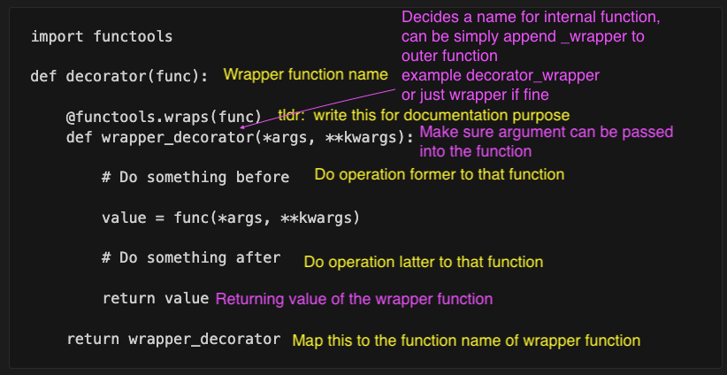

## Boilerplate template for decorator

- decorator is a wrapper function that takes another function  
and extends the behavior of the latter function
- can put the `decorator` function into file and reuse
```
import functools

def decorator(func):

    @functools.wraps(func)
    def wrapper_decorator(*args, **kwargs):

        # Do something before 

        value = func(*args, **kwargs)

        # Do something after 

        return value

    return wrapper_decorator 
```



## Sample Application

- [Check time performance](time_perforamnce.ipynb)
