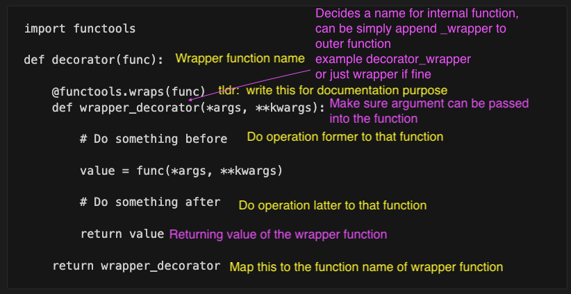

## Boilerplate template for decorator

- decorator is a wrapper function that takes another function  
and extends the behavior of the latter function
- can put the `decorator` function into file and reuse
```
import functools

def decorator(func):

    @functools.wraps(func)
    def wrapper_decorator(*args, **kwargs):

        # Do something before 

        value = func(*args, **kwargs)

        # Do something after 

        return value

    return wrapper_decorator 
```



### With argument

**If you want your decorator to also take arguments, then you need to nest the wrapper function inside another function. In this case, you usually end up with three return statements.**

- [Decorator with argument](decorator_with_argument.ipynb)
- [Decorator with optional argument](decorator_with_optional_argument.ipynb)

## Sample Application

- [Check time performance](time_perforamnce.ipynb)
- [Debugging](debugging_code.ipynb)
- Authenticating Users
  - Use wrapper to check whether user is authenticated , if yes proceed with `func`,
  - Normally the decorators does not need to be own and its written by the web framework (Flask, FastAPI, ...)
- [Singleton](https://realpython.com/primer-on-python-decorators/#creating-singletons)
  - **Note: Singleton classes aren’t really used as often in Python as in other languages. The effect of a singleton is usually better implemented as a global variable inside a module.**

### When to consider use decorator

**Overall, you should consider using decorators when you need to modify or extend the behavior of functions in a reusable and maintainable manner**

- **code reusability**: repeating code patterns
  - decorator can encapsulate the behaviour and apply it consistenly wherever need
- **separation of concerns**:
  - define cross-cutting concerns (such as logging, authentication, caching, etc) in decorators and apply them to relevant function without cluttering the function definition
  - Many Python frameworks and libraries use decorators extensively. For example, web frameworks like Flask and Django use decorators for URL routing, authentication, and other request handling tasks.
- **debugging and profiling**:
  - without changing the core implmentation

## Nesting Decorator
- Executed in the order they are placed
```
>>> from decorators import debug, do_twice

>>> @debug
... @do_twice
... def greet(name):
...     print(f"Hello {name}")
...
```
