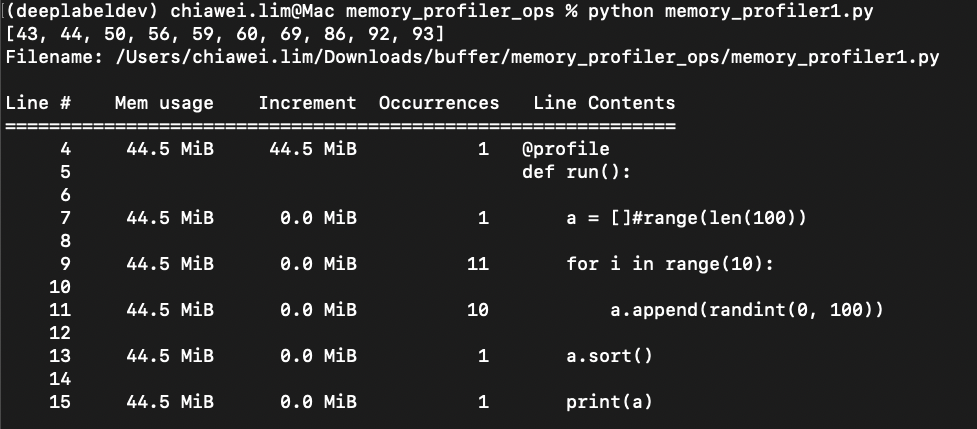
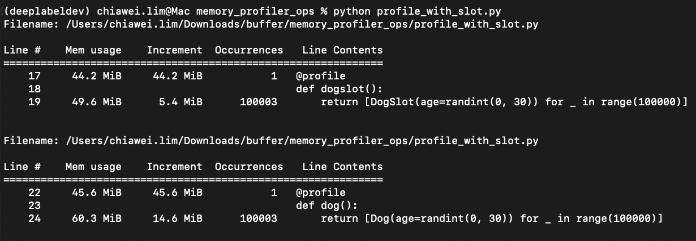

### Memory profile to count memory per command line and number of occurences

```
pip install memory_profiler
```


#TLDR

- Add 
  ```
  from memory_profiler import profile
  ```
- Add decorator `@profile` to function to profile
  ```
  @profile
  def func()
  ```
- And run normally





