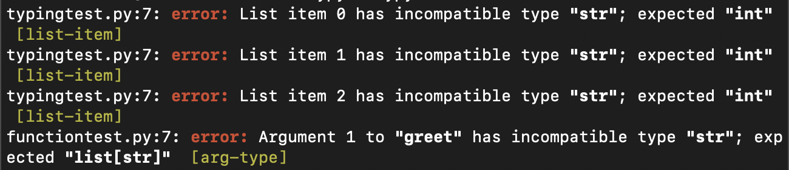

### MYPY static type checker
- Install: `pip install mypy`
- Run with: `mypy test.py`, `mypy <path-to-directory>/`
- Ignore missing imports (silently ignore any imports for which it cannot find type information): `mypy --ignore-missing-imports your_file.py`
- Specify python version: `mypy --python-version 3.8 your_file.py`

## Mypy primarily checks:

- Types declared using the typing module (or built-in type hints in Python 3.9+).
- Function arguments and return types.
- Variable annotations.
- Compatibility between the types used in your code.



## When Mypy detects type-checking issues during a CI/CD run, it exits with a non-zero status code.

### Exit Code Behavior

- Exit Code 0: Indicates success (no type-checking errors).
- Exit Code 1: Indicates that Mypy detected type-checking errors.

```
mypy your_code.py
echo $?
```