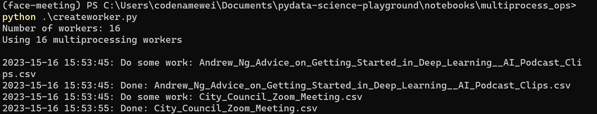

### Sample Code
```
from multiprocessing import Pool, cpu_count
cpu_count()
```
- `map()` to assign task at one time.  (use chunk size to split between worker)
- `imap()` to assign task in sequential
- `map_unordered()` to assign task at one time. (return results in arbitrary order, not the order that the task have been submitted)
- `imap_unordered()` to assign task in sequential


### Notes

- Number of worker are of number of cores
- Main process should be in the loop of `if __name__ == "__main__"` to prevent errors
  
- Seems not to work on notebooks `.ipynb`
- Read more about `pool.imap` at [here](https://superfastpython.com/multiprocessing-pool-imap/)
